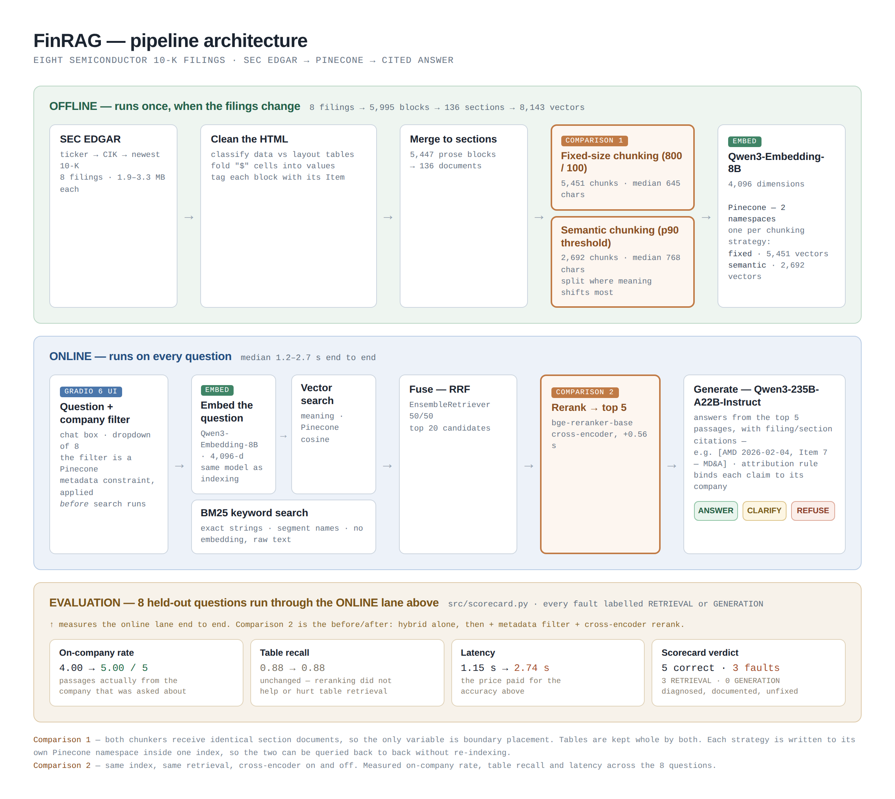

# FinRAG — asking questions of SEC filings

**The Gen Academy · Mastering Agentic AI Bootcamp · Week 2, Project 2**
Financial Document Intelligence Pipeline RAG

### Live app

[**FinRAG — live Gradio app**](https://cc8be4a044f5eabd25.gradio.live)

---

## First, for anyone who doesn't work in finance

Every company whose shares you can buy on a US stock exchange is required by
law to publish a report once a year describing how the business actually did.
That report is called a **10-K**, and it is filed with the **SEC** — the
Securities and Exchange Commission, the government agency that regulates
American financial markets.

A 10-K is not marketing. It is a long, dry, legally binding document, typically
100–200 pages, and lying in one is a federal offence. That makes it one of the
most reliable descriptions of a company that exists in public.

Every 10-K is organised into numbered sections called **Items**, and the same
Item number means the same thing at every company:

| Item | What's in it |
|---|---|
| Item 1 | Business — what the company actually sells |
| Item 1A | Risk Factors — everything management thinks could go wrong |
| Item 7 | Management's Discussion & Analysis — the company explaining its own numbers |
| Item 8 | Financial Statements — the audited figures |

A few terms that appear throughout this document:

- **Revenue** — total money coming in from sales, before any costs are taken out
- **Segment** — a slice of the business reported separately. NVIDIA reports
  "Data Center" separately from "Gaming" because they are genuinely different
  businesses
- **Fiscal year** — a company's own twelve-month accounting year, which often
  isn't January to December. AMD's 2025 fiscal year ended 27 December 2025;
  NVIDIA's ended in late January 2026
- **R&D** — research and development spending, a large line item for chip makers

The people who read these documents professionally are **equity research
analysts** — they compare companies and advise on whether shares are worth
buying. Their work involves a lot of "what was X's revenue in segment Y, and
how does it compare to Z's". That is the job this project automates.

## And what this app actually is

A language model like the one behind ChatGPT learned from a huge amount of text
up to a fixed cutoff date. It has never read these specific filings, and asking
it about them produces confident guesses.

**Retrieval-Augmented Generation (RAG)** fixes that without retraining
anything. The idea is three steps:

1. **Retrieve** — chop the documents into small passages, and when a question
   arrives, find the handful most likely to contain the answer
2. **Augment** — paste those passages into the prompt alongside the question
3. **Generate** — the model writes an answer using only what it was given

The model doesn't need to remember anything. It reads what you hand it. And
because you know exactly which passages you handed over, every claim can be
traced back to a source — which is why this app cites a company, a filing date
and an Item number on every answer.

The important consequence: **when the retrieved passages don't contain the
answer, the correct output is to say so.** A RAG system that invents a plausible
revenue figure is worse than one that admits it doesn't know, because an analyst
can act on a number. Much of this project is about making refusal work properly.

---

## Project overview

FinRAG answers analyst questions about **eight semiconductor companies** from
their most recent 10-K filings, cites every claim, and declines when the
filings cannot support an answer.

> NVIDIA · AMD · Intel · Broadcom · Qualcomm · Micron · Texas Instruments ·
> Applied Materials

All eight are in one industry on purpose. It makes comparison questions
meaningful — "which of these spent most on R&D" is a real question, where the
same question across a chipmaker and a supermarket would not be.

The project implements the two things Project 2 requires:

1. **Two chunking strategies compared** on the same questions — fixed-size
   against semantic
2. **A reranking step, measured** — on-company accuracy, table recall and
   latency, with and without

Plus the bonus: a chat interface with a company filter.

## Week 2 RAG framework

### The primer: FinRAG in one line

> My RAG app helps equity-research analysts answer company-specific questions
> from the most recent 10-K filings of eight semiconductor companies in a
> Gradio 6 chat interface, with 100% citation-supported claims and a target
> median response time of three seconds or less.

### Live app

[**FinRAG — live Gradio app**](https://cc8be4a044f5eabd25.gradio.live)

### Worked FinRAG example

**Question:** What was AMD's Data Center segment revenue?

**Answer:** AMD reported Data Center net revenue of $16.6 billion in 2025.
`[AMD 2026-02-04, Item 6 — Selected Financial Data]`

### The framework

| Field | Fill in (1 to 2 sentences max) |
|---|---|
| **Use case** (one line) | FinRAG lets equity-research analysts ask company-specific and cross-company questions about eight semiconductor companies in a Gradio 6 chat interface. It answers only from retrieved filing evidence, cites each claim, and clarifies or declines when the filings do not support an answer. |
| **Corpus** | Eight English-language, table-heavy SEC EDGAR 10-K filings: NVIDIA, AMD, Intel, Broadcom, Qualcomm, Micron, Texas Instruments, and Applied Materials. SEC EDGAR is the source of truth. |
| **Ingestion + cleaning** | The offline pipeline resolves ticker to CIK and fetches each company's newest 10-K. BeautifulSoup/lxml cleaning separates data tables from layout tables, folds currency cells into their values, preserves data tables whole, and tags each block with its SEC Item section. |
| **Ingestion + freshness** | Ingestion runs offline when a filing changes; the app cannot accept a new ticker at question time because fetching, cleaning, chunking, embedding, and indexing must happen first. The corpus is refreshed by rerunning the pipeline when a new 10-K is available; no automated freshness SLA is claimed. |
| **Chunking + embedding** | The comparison uses fixed `RecursiveCharacterTextSplitter` chunks of 800 characters with 100-character overlap and semantic chunks using 90th-percentile breakpoints; chunks under 50 characters are dropped and chunks above 2,500 characters are split. Both strategies use Qwen3-Embedding-8B via Nebius Token Factory (4,096 dimensions), keeping query and document embeddings in the same vector space. |
| **Retrieve** | Pinecone stores two namespaces—`fixed` (5,451 vectors) and `semantic` (2,692)—within one index. The online path combines Pinecone cosine search and BM25 keyword search with 50/50 Reciprocal Rank Fusion, retrieves 20 candidates, applies a pre-search company metadata filter when selected, reranks with `BAAI/bge-reranker-base`, and sends the top 5 passages to Qwen3-235B-A22B-Instruct. |

## Architecture



The pipeline splits into two halves, and keeping them straight explains most of
the design decisions.

**The offline half runs once.** Download, clean, chunk, embed, store. It is
slow and expensive — the semantic chunking step alone took just over six
minutes, and uploading to Pinecone another four and a half.

**The online half runs on every question.** Search, rerank, generate. It has to
finish in a couple of seconds.

That asymmetry is why the app can't accept an arbitrary new ticker at question
time: everything in the offline half would have to happen first, while someone
waits at a chat box.

### Reading the diagram

Six components in it are worth naming explicitly, because each one is a place
the pipeline could have been built differently.

**The same embedding model runs on both sides.** `Qwen3-Embedding-8B` appears
twice in the diagram — once offline turning 8,143 chunks into vectors, once
online turning the incoming question into a vector. This is not a detail that
can be varied. Vector search compares the question's vector against the stored
ones, and two different models produce coordinates in two unrelated spaces, so
the comparison would return noise rather than an error. Swapping the embedding
model later means re-embedding the entire corpus.

**Pinecone holds two namespaces, one per chunking strategy.** A namespace is a
partition inside a single index: `fixed` holds 5,451 vectors, `semantic` holds
2,692. Comparison 1 works by sending the identical question to each namespace
in turn and reading back what each returns. Two separate indexes would have
worked equally well but cost twice the setup; two strategies mixed into one
namespace would have made the comparison impossible to run at all.

**BM25 does not embed anything.** The keyword branch searches raw text, which
is exactly why it's there — it catches literal strings like segment names and
"Item 1A" that meaning-based search blurs together. The two branches run in
parallel and are merged by Reciprocal Rank Fusion, weighted 50/50.

**Gradio 6 is the entry point, and the company dropdown is not cosmetic.**
Choosing a company applies a Pinecone metadata constraint *before* the search
runs, so passages from the other seven are never candidates in the first place.
That is different from filtering results afterwards, and it is what moved the
on-company rate from 4.00 to 5.00 out of 5.

**"p90 threshold" is the semantic chunker's one tuning parameter.** It compares
each consecutive pair of sentences and measures how far apart their embeddings
are. The 90th percentile of those distances becomes the cut-off: split only
where the meaning shifts more than 90% of the other places it could have split.
A lower percentile produces more, smaller chunks; a higher one, fewer and
larger.

**Citations name the filing and the section, not just the passage number.**
Every chunk carries its company, filing date and Item as metadata, so a claim
resolves to something like `[AMD 2026-02-04, Item 7 — MD&A]`. A reader can open
that filing, go to that Item, and check. A bare passage number would have been
verifiable only by someone who could see the retrieved context, which is nobody
outside the app.

**The evaluation is part of the architecture, not a report about it.**
`src/scorecard.py` runs eight held-out questions through the online lane and
labels every fault as either RETRIEVAL (the wrong passages came back) or
GENERATION (the right passages came back and the answer was still wrong). The
distinction matters because the fixes are completely different and applying the
wrong one makes the system worse. Current standing: 5 correct, 3 retrieval
faults, 0 generation faults. The three metrics in the diagram's evaluation band
— on-company rate, table recall, latency — are the before/after of Comparison
2, and are discussed in full in that section below.

## The stack

| Layer | Tool | Why |
|---|---|---|
| Workspace | VS Code + Jupyter | Cell-by-cell execution with output inline |
| Language | Python 3.13 | In a virtual environment, project-local |
| RAG framework | LangChain 1.3 | Standard components; no plumbing written by hand |
| Document parsing | BeautifulSoup + lxml | 10-K HTML is table-heavy and messy |
| Model provider | Nebius Token Factory | OpenAI-compatible; supplies both models below |
| Embedding model | Qwen3-Embedding-8B | 4,096 dimensions; turns text into searchable vectors |
| Chat model | Qwen3-235B-A22B-Instruct | Reads retrieved passages, writes the cited answer |
| Vector database | Pinecone | 8,143 vectors in one index, split into a `fixed` namespace (5,451) and a `semantic` one (2,692) |
| Keyword search | BM25 (`rank_bm25`) | Exact-string matching alongside meaning-based search |
| Reranker | `BAAI/bge-reranker-base` | Cross-encoder second pass over candidates |
| Interface | Gradio 6 | Chat page with a company filter |
| Secrets | python-dotenv | Keys in `.env`, gitignored |

Two models doing two different jobs is the distinction worth holding onto. The
**embedding model finds** passages and never writes anything. The **chat model
writes** answers and never searches. When something goes wrong, "which of those
two failed?" is always the first question.

## Datasets used

Eight 10-K filings, downloaded directly from SEC EDGAR by the code — not by
hand. The corpus is defined by **ticker**, resolved to the SEC's permanent
**CIK** identifier at runtime against the SEC's published mapping file, so
there are no magic numbers in the source and an invalid ticker raises rather
than silently shrinking the corpus.

| Company | Filed | Size | Blocks extracted | Data tables |
|---|---|---|---|---|
| NVIDIA | 2026-02-25 | 1.97 MB | 763 | 58 |
| AMD | 2026-02-04 | 2.17 MB | 743 | 62 |
| Intel | 2026-01-23 | 3.32 MB | 1,030 | 89 |
| Broadcom | 2025-12-18 | 2.70 MB | 841 | 82 |
| Qualcomm | 2025-11-05 | 1.88 MB | 697 | 57 |
| Micron | 2025-10-03 | 2.44 MB | 739 | 66 |
| Texas Instruments | 2026-02-06 | 2.11 MB | 519 | 70 |
| Applied Materials | 2025-12-12 | 2.22 MB | 663 | 64 |

**5,995 blocks total** — 5,447 prose and 548 data tables.

### Why the cleaning step is custom

This is the only part of the pipeline not taken off the shelf, and there were
two specific reasons.

**Filings use `<table>` for both data and page layout.** A generic HTML loader
flattens both into text, so a segment table arrives as an undifferentiated run
of numbers with no indication which figure belongs to which year. The cleaner
classifies tables and keeps only real ones, rendering them pipe-delimited so a
row label stays attached to its figures.

**EDGAR puts the dollar sign in its own table cell.** A row arrives as
`['Data Center', '$', '16,635', '$', '12,579']` against a four-column header.
Left alone the columns stop lining up. The cleaner folds currency cells forward
into their values.

Verified on the real filings — this is AMD's segment table as the retriever
sees it:

```
Year Ended | December 27, 2025 | December 28, 2024 | December 30, 2023
(In millions)
Net revenue: Data Center | $16,635 | $12,579 | $6,496
```

Row label attached, dollar signs folded, three fiscal years aligned.

---

## Prompts and instructions

The answer prompt gives the model exactly three exits and requires it to take
one.

**ANSWER** — the passages contain it. State the figure first, cite each claim
by passage number, and give figures with the units the filing uses. A table
under a "$ in millions" header reporting 16,635 means $16,635 million, and the
answer has to say so.

**CLARIFY** — the question doesn't identify a company or period and more than
one is indexed. Ask which. Don't pick the most likely, don't answer for all
eight as a hedge.

**REFUSE** — the passages don't contain it. Say so plainly, and where the
reason is structural, name it: forward-looking guidance, quarterly results and
executive compensation are not in a 10-K, they live in earnings releases, 10-Qs
and the DEF 14A proxy statement respectively.

The refusal path was written first, before the answer path. In this domain the
worst output is not "I don't know" — it is a confident, well-formatted,
plausible number that isn't in the filing.

### The attribution rule, added after watching it fail

A fourth rule was added mid-project, and only because the system broke without
it. It sits above the three exits because it governs all of them:

> Every passage is labelled with the company it came from. That label is
> binding. If the question names a company, only passages from THAT company are
> evidence about it. A passage from a different company is not weaker evidence —
> it is no evidence at all, however closely the wording matches.

The failure that prompted it is described under *Iterations* below.

---

## Comparison 1 — fixed-size vs semantic chunking

### Setup

Both strategies receive **identical input**: the 5,447 prose blocks merged into
136 documents, one per company-and-section. This matters. Feeding a chunker
individual paragraphs makes semantic chunking meaningless — there is no topic
shift to find inside a single paragraph — and it would have left the two
strategies working on different material.

**Tables are kept whole by both.** If only one protected tables, any difference
in results could be attributed to table handling rather than boundary
placement, and the comparison would mean nothing.

| | Fixed | Semantic |
|---|---|---|
| Method | `RecursiveCharacterTextSplitter`, 800 chars, 100 overlap | `SemanticChunker`, 90th-percentile breakpoints |
| Chunks produced | 5,451 | 2,107 |
| Median length | 645 chars | 768 chars |
| Mean length | 595 chars | 1,474 chars |
| Shortest / longest | 57 / 5,379 | **2 / 18,584** |
| Time to chunk | under a second | 374 seconds |

### Semantic chunking needed guard rails

The mean sitting far above the median gave it away: a handful of enormous
chunks were dragging the average up. Semantic chunking finds topic boundaries
but guarantees nothing about size, and it produced both **2-character slivers**
(no information at all) and an **18,584-character monster** (a section that
never found a topic break).

Both ends are harmful. A sliver is noise in the index; an 18,000-character
chunk floods the model's context, and the reranker only reads its first ~512
tokens anyway, so most of it is invisible to the component judging it.

Chunks under 50 characters were dropped and chunks over 2,500 split, bringing
semantic to **2,692 chunks**. The same treatment was applied to the fixed set —
where it changed nothing, but applying it to only one strategy would have
reintroduced the confound.

### Results

Four questions, same retrieval configuration, judged by reading the passages
returned. This is a qualitative comparison; formal retrieval metrics were
explicitly not required for Week 2.

| Question | Winner | Why |
|---|---|---|
| AMD's Data Center segment revenue | **Fixed** | Returned the MD&A passage stating "$16.6 billion… increased by 32%" at rank 2. Semantic returned a pointer reading "see Note 4" and a section heading — no figure in the top two |
| Reasons NVIDIA gives for revenue change | **Semantic** | Found "Compute & Networking revenue — the year-over-year increase was driven by the major platform shifts". Fixed found only the Gaming segment, and its rank-2 result was an **AMD** passage |
| Export control risks disclosed | **Fixed** | Returned AMD, NVIDIA, AMD — two companies, which a cross-filing question needs. Semantic returned NVIDIA three times, its third hit about taxation rather than export controls |
| Intel's total operating expenses | Tie | Identical top three |

**Fixed 2, semantic 1, one tie.**

### What explains it

Semantic chunks average roughly three times the length of fixed ones. A longer
chunk covers more topics, so its embedding is a **blur of several things**
rather than a sharp signal for one. For pointed factual questions — which is
most of what an analyst asks a 10-K — that costs precision.

And note *where* semantic won: the single discursive question, "what reasons
does NVIDIA give". That is the trade-off exactly:

> **Smaller chunks retrieve precisely. Larger chunks preserve context.**
> Which is better depends on the question, and a 10-K corpus is dominated by
> pointed factual ones.

The more sophisticated technique lost on this corpus, for a reason that can be
explained rather than shrugged at. The pipeline ships with semantic chunking as
the default for the chat interface, because the retrieval configuration there
includes the company filter that removes semantic's main weakness; a
production system would reasonably choose fixed.

---

## Comparison 2 — the impact of reranking

### What a reranker is for

Retrieval scores a question against thousands of chunks, so it can only compare
vectors computed independently — the passage never "sees" the question. A
**cross-encoder** reads the question and one passage *together* and scores the
pair. Far more accurate, far too slow to run over thousands of chunks.

So each does what it is good at: retrieval casts a wide cheap net (20
candidates), the reranker makes an expensive careful decision about those 20
and keeps 5.

### Choosing what to measure

Two objective measures, chosen because they are exactly the failure modes
observed, and both computable without hand-labelling:

- **On-company rate** — of the top 5, how many come from the company the
  question names? Measured across the 4 questions naming exactly one company
- **Table recall** — how many of the top 5 are data tables? A proxy for whether
  numeric questions can be answered at all. Measured across all 8

Plus median latency.

### Results

| Configuration | On-company | Table recall | Median latency |
|---|---|---|---|
| Hybrid retrieval only | 4.00 / 5 | 0.88 / 5 | 1.15 s |
| Hybrid + rerank | **3.50 / 5** | **1.12 / 5** | 1.71 s |
| Hybrid + rerank + company filter | **5.00 / 5** | 0.88 / 5 | 2.74 s |

**Reranking alone trades entity precision for table recall, and costs about
half a second.** It made on-company *worse* and table recall *better*.

The top-ranked passage changed on **all eight** questions. The reranker is not
making marginal adjustments — it rewrites the top result every time, and the
aggregate effect is still roughly a wash.

### The measurement that looked like a loss and wasn't

Adding the company filter pushed on-company to a perfect 5.00 — it is
structurally impossible to retrieve another company's passage from a filtered
namespace. But **table recall fell back** to 0.88, apparently undoing the
reranker's only gain.

It didn't. The extra tables reranking had been finding were **the wrong
company's tables**. On the AMD question, unfiltered reranking placed an
**Intel** table at rank 2 — it counted toward "tables retrieved" while being
useless for answering. Filtering removes it, the count drops, and the results
get better.

**A metric improved because the system got worse.** Only knowing what the
retrieved passages actually were distinguished a real gain from a spurious one.

### Conclusion

The deployed configuration is **hybrid retrieval + reranking + company
filtering**, because filtering makes the reranker's entity blindness
structurally irrelevant, leaving only its table-reading benefit.

---

## Evaluation

Evaluation is bonus credit for Week 2 and is covered properly in Week 4, so
this is deliberately small: eight questions, run end to end, with one human
judgement per row.

The eight are chosen to cover four categories: **factual lookup** (4),
**cross-company** (1), **ambiguous** (1, should ask rather than guess), and
**unanswerable** (2, should refuse).

| Test question | Right evidence retrieved? | Grounded and cited? | What happened |
|---|---|---|---|
| NVIDIA's total revenue, most recent fiscal year | No | n/a — declined | **RETRIEVAL** — the answer exists in the corpus but wasn't found; refusing was the correct response |
| AMD's Data Center segment revenue | Yes | Yes | Correct — $16,635M and $12,579M, verified against the filing |
| Compare R&D spending across these companies | Partly | n/a — declined | **RETRIEVAL** — only some companies' R&D figures came back |
| What supply chain risks does AMD disclose? | No | Yes | **RETRIEVAL** — matched "supply chain" where it appears incidentally in a cybersecurity passage |
| Export control risks across these filings | Yes | Yes | Correct — attributed per company by name |
| How is the company performing? | n/a — underspecified | Yes | Correct — asked which company rather than guessing |
| NVIDIA's forecast revenue for FY2028 | No evidence exists | Yes | Correct — refused, naming forward-looking guidance as the structural reason |
| CEO cash bonus paid March 2026 | No evidence exists | Yes | Correct — refused, correctly pointing to the DEF 14A proxy |

**Three retrieval faults, zero generation faults** in the final configuration.
Five of eight fully correct, and every failure is a case of the right passage
not arriving rather than the model misusing what it got.

### The failure worth reading in detail

Asked *"what supply chain risks does AMD disclose?"*, the app answered about IT
outages, data breaches and cyberattacks. Correct in form — every claim cited,
every passage AMD's — but about the wrong topic.

The cause is precise. The passage it used contains the sentence *"threats may
be generic or specifically targeted against AMD's IT Systems or supply chain"*.
**BM25 matched the phrase "supply chain" where it appears incidentally**, inside
a paragraph about cybersecurity, rather than AMD's genuine supply-chain risk
disclosure about supplier lead times and capacity constraints — which probably
never uses that exact phrase.

This is the same mechanism that *rescued* the AMD Data Center question. Keyword
search has no idea whether a phrase is a passage's subject or a passing
mention.

> Keyword search wins when the query phrase labels the answer, and loses when
> the phrase appears incidentally elsewhere. Vector search has the opposite
> profile. Fusing them does not eliminate the failure — it makes it rarer.

---

## Iterations tried

Every one of these was found by running the pipeline and reading the output.

### 1 · A library shipped a major version mid-project

`requirements.txt` said `langchain>=0.3.0`, meaning "0.3 or anything newer".
LangChain 1.0 had since shipped, and it moved `EnsembleRetriever`,
`ContextualCompressionRetriever` and `CrossEncoderReranker` into a companion
package, `langchain-classic`.

**Spotted by reading the `pip install` output** rather than by hitting the
error: a package named `langchain-classic` appeared that had never been
requested, and "classic" is what libraries call the place old furniture goes
after a reorganisation. Confirmed against LangChain's own reference docs, then
verified empirically with a script importing all 16 things the notebook needs.

**Fix:** try the new import path, fall back to the old one, and pin the
requirement. An open-ended version range is a bet that no library will ever
break anything.

### 2 · HTTPS certificate verification failed

Downloading from EDGAR failed with `CERTIFICATE_VERIFY_FAILED: unable to get
local issuer certificate`. Python installed from python.org does not use the
macOS keychain — it looks for a certificate bundle nobody has installed.

The common advice is to run `Install Certificates.command`, which fixes one
machine. **Fix:** point at `certifi` in code instead, so the repo works on any
machine. Verification was not disabled — the missing trust list was supplied.

### 3 · One filing used a different convention

Item-based section detection found **16–19 sections for seven companies and 1
for Intel**. Investigation showed Intel files a **cross-reference 10-K**: the
Item numbers appear only in an index pointing at page numbers, and the body
runs under plain titles like "Risk Factors" and "Liquidity and Capital
Resources".

Nothing was wrong with the parser. Intel's document genuinely has no Item
headings to find.

**Fix:** when Item detection finds two or fewer sections, retry reading bare
titles and map them back to Item numbers. Guarded so the seven working filings
are untouched. Intel went from **1 section to 13**, distributed sensibly.

### 4 · Semantic chunking was being asked a meaningless question

The first attempt passed the cleaner's output — **5,447 individual paragraphs** —
straight to `SemanticChunker`. That would have meant thousands of sequential API
round-trips, and worse, it asks a question with no answer: there is no topic
shift to find *inside* one paragraph.

**Fix:** merge consecutive prose blocks into one document per company-and-section
first, giving 136 documents instead of 5,447. Faster, and it also removed a
fairness problem — the fixed splitter had been receiving paragraphs one at a
time too, so neither strategy could span a paragraph boundary.

### 5 · The reranker made results worse

The first reranker, `cross-encoder/ms-marco-MiniLM-L-6-v2`, **removed the
segment table** containing the answer and promoted **AMD** passages onto an
NVIDIA question. Slower and worse.

Diagnosis: ms-marco is trained on web search — query and prose passage pairs. A
financial table arrives as `(in millions) | Data Center | Embedded |`, which
looks like noise to it, so it scores real tables low and fluent paragraphs
high.

**Fix, iteration one:** swap to `BAAI/bge-reranker-base`, trained on more varied
data. Table handling improved immediately — on the AMD question it promoted
three tables where ms-marco had promoted none.

**But entity blindness persisted**, in both models. Cross-encoders score
topical relevance; a company name in the question is just another word, not a
constraint. That half is not fixable by changing rerankers.

**Fix, iteration two:** metadata filtering — restrict the search to one
company's namespace before it runs. Measured at 5.00/5 on-company.

### 6 · Cross-company misattribution in the generated answer

Asked about AMD's supply chain risks, the app answered *"AMD discloses that it
relies on third-party foundries…"* and cited passage [3] — **an Intel passage**.
AMD is in fact fabless, so the claim was true in the world. It simply was not
supported by the source it pointed at.

**That is unfaithfulness in its purest form**, and precisely the failure
citations exist to prevent: a reader following the citation would not find the
claim there. Retrieval had done its job; generation had not.

**Fix:** the attribution rule quoted earlier. After the change, the same
question with the same retrieved passages produced an answer drawn only from
AMD's passages, correctly cited.

### 7 · Fixing generation revealed a retrieval fault it had been hiding

With the attribution rule in place, that AMD question stopped borrowing from
Intel — and started answering the *wrong topic*, because AMD's genuine
supply-chain passage hadn't been retrieved.

Generation had been **papering over bad retrieval**. The output looked fine
because the model quietly reached for a neighbouring company's passage when the
right one was missing. Removing that crutch made the retrieval failure visible.

The honest prompt did not create a problem. It exposed one.

### 8 · The automated scorecard missed the worst failure

The scorecard reported **zero generation faults** on the run containing the
misattribution. It could verify that a citation *existed*; it could not verify
the citation was *right*. Only reading the answer against the retrieved
passages caught it.

Combined with the table-recall result described earlier, **every metric in this
project was improvable by making the system worse.**

---

## Learnings and observations

**Read the install output.** Two of the eight problems above were visible in
text that scrolls past and is usually ignored — an unexpected package name and
a version number one major release higher than expected.

**Metrics need eyes on the data.** Twice, independently, a number moved in a
direction that suggested something untrue: table recall improved because wrong-
company tables were being counted, and the scorecard passed a question whose
answer cited the wrong document. The instruction from the sessions not to
over-index on metrics turned out to be load-bearing advice.

**Separating retrieval from generation is the single most useful diagnostic.**
The two have completely different fixes — chunking, metadata and reranking on
one side, the prompt on the other. Three of the failures above were only
solvable once it was clear which side they belonged to. One of them, #7,
existed only because the generator had been compensating for the retriever.

**The sophisticated option lost.** Semantic chunking is the cleverer technique
and it came second, for an explicable reason. So did the first reranker, which
actively degraded results. Neither outcome was a mistake in the experiment —
they were the results.

**Real data doesn't follow the spec.** Seven filings used Item headings; one
didn't. Planning for eight identical documents would have produced a system
that silently mislabelled an eighth of the corpus.

**Ask the system what it supports.** The models named in the original plan did
not exist on the account used. Listing them before anything expensive ran cost
one API call and removed a whole class of confusing failure.

**Solve it in the code, not the machine.** The certificate fix, the working-
directory fix and the secrets handling could each have been solved by
configuring one laptop. Solving them in the repository means the project runs
for anyone who clones it.

## Limitations, stated honestly

- **Eight questions, single run.** The reranking measurements are indicative,
  not precise. Retrieval is not fully deterministic — the same question returned
  different passages on different runs, and one scorecard verdict changed
  between runs as a result.
- **Comparison 1 is qualitative**, judged over four questions by reading the
  passages. Enough to identify the trade-off and explain it; not enough to
  quantify it.
- **Latency figures are noisy** at this sample size. The honest summary is
  roughly 1–3 seconds end to end, with reranking adding about half a second.
- **Section tagging is imperfect.** A stock performance table was tagged
  `Item 4 — Mine Safety Disclosures`, and some boundaries land a block late.
  This affects citation precision, not retrieval.
- **Three of eight questions still fail on retrieval.** They are diagnosed, not
  fixed. The most promising next step is query preprocessing — recognising that
  "supply chain risks" should weight the *topic* of a passage rather than the
  mere presence of the phrase.
- **`langchain-experimental`, which provides `SemanticChunker`, is being
  retired.** One of the two graded comparisons depends on a package with a
  deprecation notice.

## Running it

```bash
python3 -m venv .venv && source .venv/bin/activate
pip install -r requirements.txt
cp .env.example .env          # add NEBIUS_API_KEY and PINECONE_API_KEY
```

Open `notebooks/FinRAG.ipynb` in VS Code, select the `.venv` kernel, run top to
bottom. Full instructions in `SETUP.md`.

Offline tests, no keys and no network required:

```bash
python3 -m tests.test_offline      # 54 — fetching, cleaning, tables, sections
```

**Repository layout**

```
src/fetch_filings.py   ticker → CIK → newest 10-K, from SEC EDGAR
src/clean.py           HTML → clean, section-tagged, table-aware blocks
src/to_documents.py    blocks → LangChain Documents (the only bridge)
src/prompts.py         the answer prompt, three exits, attribution rule
src/scorecard.py       evaluation table + retrieval-vs-generation diagnosis
notebooks/FinRAG.ipynb the pipeline, run cell by cell
DECISIONS.md           why the project is shaped this way
ENGINEERING_LOG.md     problems hit and how each was diagnosed
```
